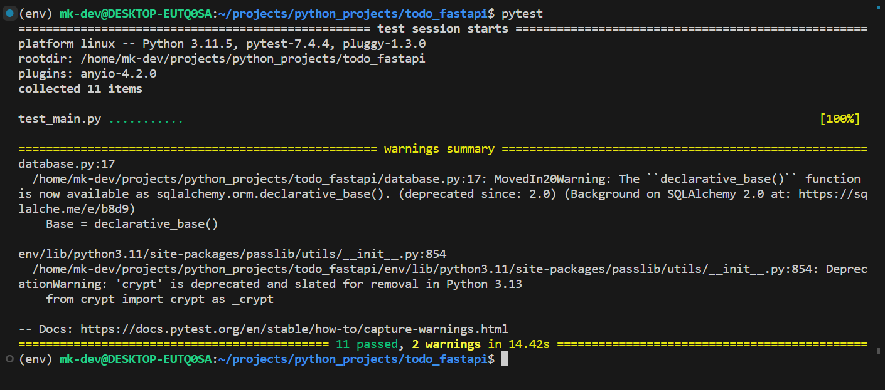

# FastAPI Todo API

## Description

This is a simple API to manage todo items. It's built with FastAPI and uses SQLAlchemy for database operations. The API allows users to create, read, update, and delete todo items. It also includes user authentication.

## Installation

1. Clone the repository.
2. Install the dependencies using pip:

```python
pip install -r requirements.txt
```

3. Set up the environment variables. You'll need to set `NEON_SECRET_URL` for the database and `SECRET_KEY` for JWT authentication (JWT Token only required for **Pytest**).

## Usage

1. Run the server:
```
uvicorn main:app --reload
```

2. Visit `localhost:8000` in your web browser to see the application running.

## Testing

We use Pytest for testing. To run the tests, use the following command:


```
pytest
```

Here's the result when I used Pytest



## Code Overview

The project includes several Python files:

- `auth.py`: This file contains the routes and logic for user authentication. It includes signup and login routes, and uses JWT for access tokens.
- `main.py`: This is the main file that includes the FastAPI application instance and the routes for managing todo items.
- `database.py`: This file sets up the SQLAlchemy engine and session.
- `test_main.py`: This file includes the tests for the application.

Please refer to the code in these files for more details.

## Contributing

Contributions are welcome! Please feel free to submit a Pull Request.

## License

This project is licensed under the terms of the MIT license.
